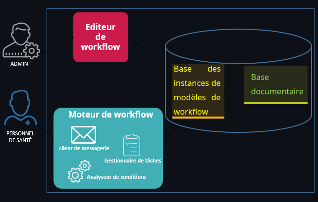

  
  
CollabDoc

## A propos de CollabDoc

Intitulée CollaDoc pour faire référence au travail collaboratif sur les documents,  cette application permet d'aider les utilisateurs à bien maitriser leurs documents papier. Elle offre également des fonctionnalités de modélisation de flux documentaire qui
permettent de concevoir des workflow tout en créant des tâches successives ou parallèles,
des alertes à travers l’envoie d’email ou même encore des conditions pour une prise de
décision automatique.

## Architecture de l'application

 

## Fonctionnalités
* L’application permet d’importer des documents sous plusieurs formats.
* L’application conserve un historique des différentes versions des documents.
* L’application gère les droits d’accès aux documents selon les profils utilisateurs.
* L’application identifie chaque type de document avec des métadonnées.
* L’application permet de rechercher les documents d’une façon efficace en utilisant des filtres.
* L’application permet de modéliser et gérer automatiquement le flux des documents.
* L’application comporte un système de messagerie interne pour une meilleuresécurité lors du partage de l’information.
* L’application permet aux utilisateurs de suivre et de consulter leurs
documents tout au long de leurs cycles de vie. 

## Technologies 
Les principales technologies utilisées sont:
* Coté client:
  * [Bootstrap](https://getbootstrap.com/): Version 4.0
  * [JQuery](https://example.com): Version 3.2
  * [JQuery.flowchart](https://github.com/sdrdis/jquery.flowchart)

* Coté serveur
  * [Laravel](https://laravel.com/): Version 5.7
  * [Mysql](https://www.mysql.com/fr/)

